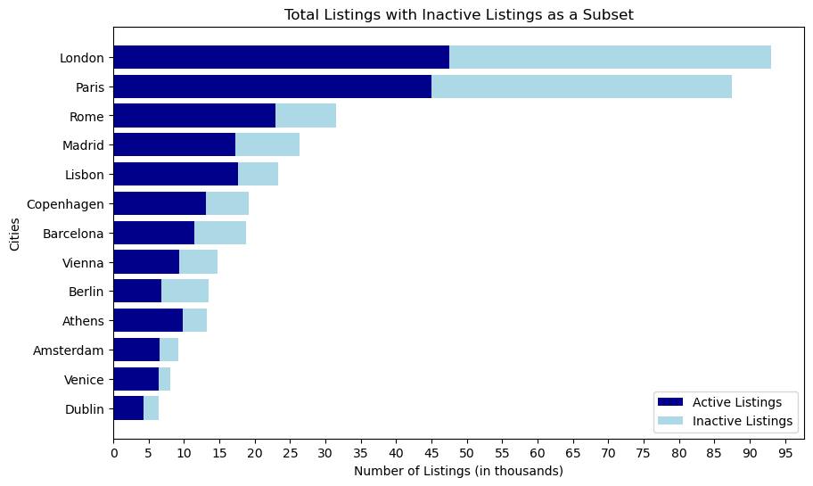
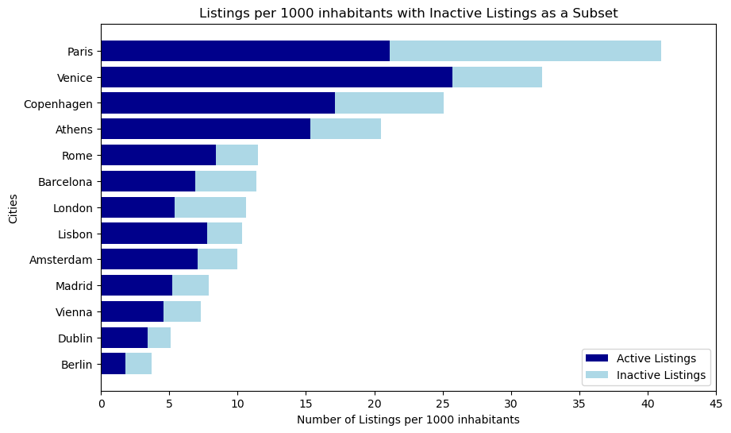

# Airbnb Across 13 European Cities

How far short-term rentals have actually gone — measured against the population that has to live with them.

> **University coursework, on public data.** This was an assignment, not client work. Everything comes from [Inside Airbnb](https://insideairbnb.com/), which publishes scraped snapshots of Airbnb listings; the analysis, the methodology choices and the conclusions are mine.

Twelve months of data, four scraping snapshots per city, thirteen cities: Amsterdam, Athens, Barcelona, Berlin, Copenhagen, Dublin, Lisbon, London, Madrid, Paris, Rome, Venice, Vienna.

---

## The five questions

The assignment set five tasks. This README is organised around what the answers *turned out to be*, so here is the original brief, and where each one is answered.

| | The question | Answered in |
| --- | --- | --- |
| **1** | Find the number of listings per city. Tabulate it and plot it. | [Counting listings](#counting-listings-is-the-wrong-way-to-look-at-this) |
| **2** | Find the **density** — listings per 1,000 inhabitants. *Determine the number of inhabitants per city in the most appropriate way.* Tabulate and plot. | [Counting listings](#counting-listings-is-the-wrong-way-to-look-at-this) · [Methodology](#methodology-decisions-that-actually-mattered) |
| **3** | Find bookings and **income per listing**. Assume **half of bookings leave a review**, and each booking is **three nights**. Income = price × bookings. | [What a listing earns](#what-a-listing-earns) |
| **4** | Find **total** bookings and nights per city. **Compare against publicly available data.** Explain how you sourced it, the methodology behind its collection, and your **assessment of its quality**. Discuss the differences. | [Checking the numbers](#checking-the-numbers-against-someone-elses) |
| **5** | **Replicate** Inside Airbnb's own city visualisations, and make them **interactive** — a dropdown to switch city. | [The interactive piece](#the-interactive-piece) |

Two of these carry more weight than they look. Task 2's *"in the most appropriate way"* is the whole of the density problem hiding in a subordinate clause — get the denominator wrong and every number is wrong. And Task 4 doesn't ask you to be right; it asks you to find out **why you disagree** with someone else, which is a harder and more useful question.

---

## Counting listings is the wrong way to look at this

London has **93,073** listings and Paris has **87,518** — the two biggest markets by a distance. Venice sits near the bottom of the table. Read the raw counts and you'd conclude Venice barely has an Airbnb problem at all.



It has the worst one in Europe.

London has 8.8 million residents. Venice has 250,000. Divide by the population that actually lives there, and the chart turns inside out:



Venice goes from second-from-last to second place. London falls to mid-table.

And density alone still isn't the end of it. A listing that hasn't been booked in twelve months isn't taking a home off anyone's market. So both charts split each bar: **active** listings in dark, **dormant** ones in pale — and the dark bars are the ones that matter.

| City | Listings / 1,000 residents | **Active** / 1,000 | Dormant |
| --- | --- | --- | --- |
| **Venice** | 32.3 | **25.6** | 21% |
| **Paris** | **41.0** | 21.1 | 49% |
| Copenhagen | 25.1 | 17.1 | 32% |
| Athens | 20.5 | 15.3 | 25% |
| Rome | 11.5 | 8.3 | 27% |
| Lisbon | 10.3 | 7.8 | 24% |
| Amsterdam | 10.0 | 7.1 | 29% |
| Barcelona | 11.4 | 6.9 | 39% |
| London | 10.6 | 5.4 | 49% |
| Madrid | 7.9 | 5.2 | 34% |
| Vienna | 7.3 | 4.6 | 37% |
| Dublin | 5.1 | 3.4 | 33% |
| **Berlin** | **3.7** | **1.9** | 50% |

**The ranking flips again.** Paris leads on paper with 41 listings per 1,000 residents — but **half of them are dormant**. Venice's are not. Look back at the second chart: Paris has the longest bar, but Venice has the longest *dark* one. Counting only listings that actually get booked, **Venice comes first**: 25.6 active Airbnbs per 1,000 residents, or **one active Airbnb for every 39 people who live there.**

**And Berlin is the outlier at the other end** — 1.9 active listings per 1,000, *thirteen times* below Venice, in a city with a well-known and aggressively enforced short-let regime. Whatever you think of the policy, the data says it worked.

## A detour: Dublin, and a hypothesis that held

The listing counts move a lot between snapshots, and two of the moves were large enough to demand an explanation.

**Dublin lost roughly 4,300 listings — about half its inventory — between December 2023 and 22 March 2024.** That is not a market collapse; something removed them from availability.

The obvious suspect is **St Patrick's Day**, 17 March, when hundreds of thousands of visitors descend on the city and every bed in it is spoken for. But that's a story, not a finding. So I tested it: *if* the drop is St Patrick's Day, then the single date with the most unavailable listings in Dublin should sit right on top of the holiday.

```
Date with the maximum count of unavailable listings: 2024-03-16   (7,901 listings)
```

**16 March — the eve of St Patrick's Day.** The hypothesis survives contact with the data.

**Paris moved the other way**: listings *rose* by roughly 20,000 — **+30%** — between December 2023 and June 2024, ahead of the summer 2024 Olympic Games. Hosts saw the Olympics coming and put their homes on the market.

Neither of these is visible if you only look at the annual average. They're only visible because the analysis keeps all four snapshots and looks at the movement between them.

## What a listing earns

Estimated average annual income per active listing:

| City | Income per listing (EUR / year) |
| --- | --- |
| **Venice** | **25,946** |
| Barcelona | 22,279 |
| Rome | 21,484 |
| Dublin | 21,165 |
| Madrid | 17,081 |
| Amsterdam | 16,285 |
| Lisbon | 15,488 |
| Berlin | 14,471 |
| Paris | 13,912 |
| London | 13,344 |
| Vienna | 12,575 |
| Athens | 11,237 |
| **Copenhagen** | **7,516** |

Venice tops this table too — it is both the densest active market *and* the most lucrative one per listing, which is precisely why the pressure there is what it is.

**Copenhagen is the interesting anomaly.** It has the third-highest active density (17.1 per 1,000) but by far the *lowest* income per listing (€7,516 — a third of Venice's). A lot of hosts, each earning comparatively little: the profile of casual home-sharing rather than a professionalised rental business.

## Checking the numbers against someone else's

Task 4 asks for the total bookings and nights per city, and then — the interesting half — to compare them against public data and **explain the difference**.

Bookings here are not observed. They're inferred from review counts, using the assumption the assignment hands you: **half of all bookings leave a review, and every booking is three nights.** So `bookings = 2 × reviews`. That assumption is the load-bearing wall of the whole estimate, and the point of Task 4 is to go and find out whether it holds.

I compared my totals against **[AirDNA](https://www.airdna.co/)**, a commercial short-term-rental analytics provider, deriving their bookings as `occupancy rate × active listings × 365 ÷ 3`.

My numbers came out **lower than AirDNA's in 11 of the 13 cities** — London by 44%, Paris by 36%.

A gap that large has to come from somewhere, and there are only two candidates: we disagree about **how many listings are active**, or we disagree about **how often they're booked**. Those are separable, so I checked the first one:

| | My active listings | AirDNA | Gap |
| --- | --- | --- | --- |
| Paris | 45,003 | 44,988 | **0.03%** |
| Barcelona | 11,438 | 12,050 | 5% |
| Berlin | 6,772 | 7,188 | 6% |

The listing counts agree — Paris to within **fifteen listings out of forty-five thousand**. The denominators are not the problem. **So the entire divergence sits in the occupancy assumption**, and it isolates cleanly to that prescribed `2 × reviews` rule.

Which means: **these figures are a floor, not an estimate.** If fewer than half of stays actually leave a review — and the AirDNA comparison suggests they do — then real bookings are higher than everything reported here, systematically, in every city.

That is the honest answer to Task 4, and it's a better one than agreeing with AirDNA would have been. The value of the cross-check isn't that it validates the numbers; it's that it identifies *precisely which assumption* they're hostage to.

## Methodology decisions that actually mattered

Most of the work in this analysis wasn't the statistics. It was four judgement calls, any one of which would have silently wrecked the result:

**1. Matching the population to the map, not to the city name.** A density figure is a fraction, and the denominator has to describe the same territory as the numerator. Inside Airbnb's Amsterdam data covers the municipality *excluding* Weesp, so Weesp's 19,370 residents come out of the population. Copenhagen's map *includes* Frederiksberg, so its 104,899 residents go in. Dublin is four separate administrative areas that have to be summed. Take the headline city population off Wikipedia instead and every number in the density table is wrong.

**2. Defining "inactive," and then discovering I'd reinvented something.** I treated a listing with no reviews in twelve months as dormant. Only afterwards did I notice Inside Airbnb ships a filter called *"only recent and frequently booked"* that does substantially the same thing — so the notebook doesn't rebuild that control, because the data already has it baked in.

**3. Cutting the price outliers.** The raw data claims a listing in Rome at **€74,000 a night** and one in Athens at **€60,543**. The most expensive Airbnb in Europe is reported at roughly €21,500 a night, in Switzerland. These are data-entry noise, and a mean is defenceless against them — so the top 0.1% of prices is trimmed.

**4. Holding the cohort fixed.** Listings appear and disappear between snapshots. Averaging income across a listing that existed for two months and one that existed for twelve compares nothing to nothing — so the income analysis uses only listings present in *all four* scrapes, and averages each one's price across them.

## The interactive piece

The notebook closes by rebuilding Inside Airbnb's own city dashboards in **Vega-Altair**, driven by a city dropdown: room types, booking recency, licence status, minimum-nights distribution, and listings per host.

The licence chart is the one worth looking at — it's the clearest single view of which cities enforce short-let registration and which don't.

> **These five charts do not render on GitHub.** Altair emits Vega-Lite as JavaScript, and GitHub's notebook viewer strips JavaScript for security — so they show up blank here, no matter how the notebook was saved. To see them, open the notebook locally (or in [nbviewer](https://nbviewer.org/)) and run the cells. The two static charts above are matplotlib, which is why they survive.

## Running it

Data is **not** in this repository — it's tens of gigabytes. Download the listings and reviews CSVs for the thirteen cities from [insideairbnb.com/get-the-data](https://insideairbnb.com/get-the-data/), keeping one folder per city, then open the notebook.

```bash
pip install pandas numpy matplotlib altair jupyter
jupyter notebook my_airbnb_analysis.ipynb
```

Population figures are hardcoded in the notebook, each with its national-statistics-office source cited inline.

## Stack

Python · pandas · NumPy · Matplotlib · Vega-Altair · Jupyter

## Sources

- **[Inside Airbnb](https://insideairbnb.com/)** — listings and reviews snapshots
- **[City Population](https://citypopulation.de/)** — population by administrative area, sourced from each country's national statistics office
- **[AirDNA](https://www.airdna.co/)** — occupancy rates, used as the independent cross-check
